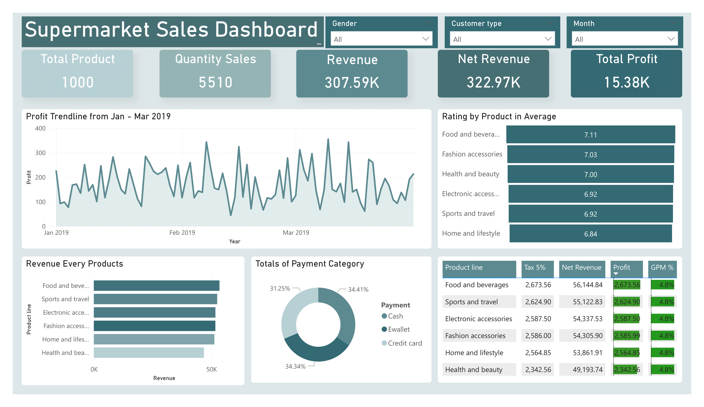

# Supermarket Sales Dashboard | Power BI Data Analysis Project

## Project Overview
This project focuses on analyzing supermarket sales performance using **Power BI**. The dashboard provides insights into revenue, profit, sales quantity, payment methods, and product performance to support **data-driven business decision making**.

The analysis covers transaction data from **January to March 2019**.

---

## Business Objectives
- Analyze overall sales and profit performance
- Identify top-performing and low-performing product lines
- Understand customer payment behavior
- Monitor profit trends over time
- Support strategic business recommendations

---

## Dataset Information
- **Source**: Supermarket Sales Dataset (Kaggle)
- **Data Type**: Transactional sales data
- **Records**: ~1000 transactions
- **Time Period**: Jan – Mar 2019

### Key Attributes
- Product line
- Quantity sold
- Revenue
- Tax (5%)
- Net revenue
- Profit
- Gross Profit Margin (GPM)
- Payment method
- Customer rating
- Gender
- Customer type

---

## Tools & Skills
- **Power BI**
- **Microsoft Excel**
- Data Cleaning & Transformation
- Data Modeling
- KPI Development
- Data Visualization
- Business & Sales Analysis
- Dashboard Design

---

## Dashboard Features
- **KPI Cards**
  - Total Products
  - Quantity Sales
  - Revenue
  - Net Revenue
  - Total Profit
- **Profit Trend Analysis**
  - Daily profit trend from Jan–Mar 2019
- **Revenue by Product Line**
  - Comparison of sales contribution per category
- **Average Rating by Product**
  - Customer satisfaction analysis
- **Payment Method Distribution**
  - Cash vs E-wallet vs Credit Card
- **Detailed Summary Table**
  - Tax, Net Revenue, Profit, and GPM per product line

---

## Key Insights
- **Food and Beverages** is the highest revenue and profit contributor.
- All product lines show a **consistent Gross Profit Margin of ~4.8%**, indicating stable pricing strategy.
- Payment methods are evenly distributed, with **digital payments (E-wallet)** showing strong adoption.
- Daily profit fluctuates but remains stable throughout the analysis period.
- Average customer ratings range from **6.8 to 7.1**, reflecting generally positive customer satisfaction.

---

## Business Recommendations
- Prioritize marketing and inventory optimization for **Food and Beverages**.
- Maintain current cost structure to preserve stable profit margins.
- Encourage digital payment adoption through promotions.
- Continuously monitor daily profit trends to detect anomalies early.

---

## Dashboard Preview

---

## Repository Structure

'''
supermarket-sales-dashboard/
├── data/
│   └── supermarket_sales.xlsx
├── dashboard/
│   └── supermarketsales.pbix
├── images/
│   └── supermarketsales-1.png
└── README.md
'''

---
